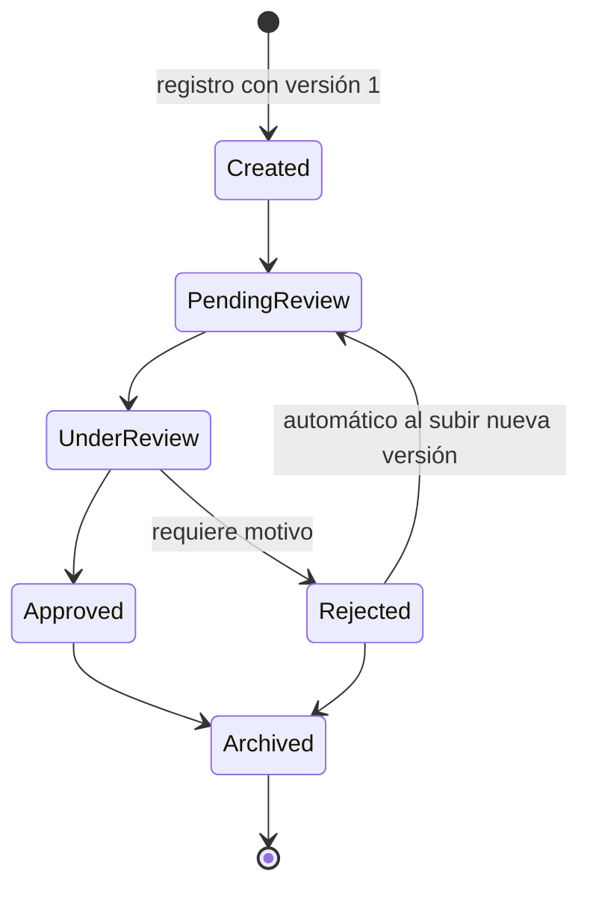

# ecert — Document Review API

API REST en **.NET 10** para gestionar documentos PDF a través de un flujo de revisión y aprobación: versiones, estados, observaciones y trazabilidad completa. Los metadatos, estados y auditoría se persisten en **PostgreSQL** (EF Core); los archivos PDF se guardan en disco, en un volumen Docker. El análisis del PDF está integrado vía **PdfPig**.

## Ejecución (Docker)

```bash
docker compose up --build -d
```

Eso levanta PostgreSQL y la API; al arrancar, la API **aplica migraciones y siembra datos de ejemplo automáticamente**.

| Recurso | URL |
|---|---|
| API | `http://localhost:8080` |
| Documentación interactiva (Swagger UI) | <http://localhost:8080/swagger> |
| Especificación OpenAPI | <http://localhost:8080/openapi/v1.json> |
| Health check | <http://localhost:8080/health> |

## Demo

- **Swagger UI (consola)**: abrir <http://localhost:8080/swagger>. Muestra un dashboard en vivo con tres tablas que resaltan las filas nuevas a medida que se ejecuta cada operación. Los endpoints están ordenados como un ciclo de vida de un documento y los bodies vienen pre-armados.
- **Postman**: importar `Ecert.DocsReview.postman_collection.json`. Las carpetas están ordenadas como registro → consulta → estados → observaciones → historial → versiones → validaciones e incluyen casos de éxito y de error.

## Ciclo de vida del documento




## Datos sembrados

El seeder deja tres documentos que cubren distintas etapas del ciclo de vida:

| Documento | Tipo | Estado | Demuestra |
|---|---|---|---|
| Service Contract 2026 | Contract | PendingReview | Documento recién enviado, en cola de revisión |
| Quarterly Report Q1 | Report | Rejected | Dos versiones y dos rondas de rechazo con motivos; historial extenso |
| Pricing Quotation - Cert Renewal | Quotation | Approved | Flujo feliz completo con un comentario de revisión |

## Decisiones

- **Integración externa — PdfPig** al subir cada versión se valida que el archivo sea un PDF real y se obtiene el **conteo de páginas**, que se persiste y expone en las respuestas. Se eligió una biblioteca local en lugar de una API ya que no requierecredenciales ni red, y la integración aún queda claramente separada del dominio detrás de la interfaz `IPdfAnalyzer` (`Infrastructure/Pdf/`)
- **Archivos en disco, metadatos en PostgreSQL**: los PDF se guardan vía `IFileStorage` (volumen Docker) y la base guarda metadatos + SHA-256 (fingerprint del archivo). El almacenamiento también queda separado del dominio detrás de la interfaz `IFileStorage`, por lo que puede reemplazarse fácilmente por otro backend (p. ej. S3) implementando esa interfaz, sin tocar el resto de la aplicación.
- **Las observaciones apuntan a la versión del documento**: cada observación queda asociada a la versión sobre la que fue hecha, así se sabe exactamente a qué contenido se refería el comentario.
- **Máquina de estados como dominio puro** (`Domain/DocumentStateMachine.cs`): sin dependencias de EF ni HTTP, cada regla es testeable en aislamiento.
- **Trazabilidad por eventos**: cada acción (creación, subida de versión, cambio de estado, observación) genera un `DocumentEvent` inmutable; `GET /history` es la auditoría completa.
- **Errores como ProblemDetails (RFC 7807)**: 400 de validación, 404 inexistente, 409 conflicto de estado, con detalle legible.
- **Tests**: 87 pruebas (unitarias de dominio e integración del pipeline HTTP real con `WebApplicationFactory` sobre SQLite en memoria). La documentación (OpenAPI/Swagger) también tiene smoke tests.

## Estructura del proyecto

```
src/Ecert.DocsReview.Api/
  Domain/           # Entidades, enums y máquina de estados (sin dependencias)
  Application/      # DocumentService: casos de uso y orquestación
  Contracts/        # DTOs de request/response
  Controllers/      # DocumentsController (REST)
  Infrastructure/   # EF Core (AppDbContext, migraciones, seeder), storage, PdfPig
tests/Ecert.DocsReview.Tests/
samples/            # PDFs de ejemplo para el tour (contrato-v1.pdf, contrato-v2.pdf)
```

## Reglas implementadas por `DocumentStateMachine`:

- Solo se aceptan **nuevas versiones** en `Created`, `PendingReview` o `Rejected`; en un documento rechazado, la subida lo reencola automáticamente a `PendingReview`.
- Las **observaciones** solo se registran dentro del bucle de revisión (`PendingReview`, `UnderReview`, `Rejected`).
- **Rechazar exige un motivo**, que se persiste como observación `RejectionReason` sobre la versión rechazada.
- Se rechazan archivos que no son PDF, vacíos, demasiado grandes o **idénticos a la versión vigente** (comparación por SHA-256).

## Ejecutar los tests

Requiere el SDK de .NET 10 (no necesita base de datos: los tests de integración usan SQLite en memoria).

```bash
dotnet test
```