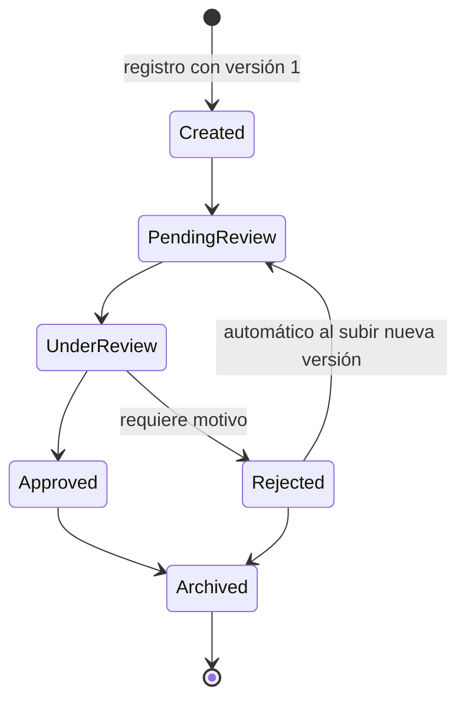

# ecert — Document Review API

API REST en **.NET 10** para gestionar documentos PDF a través de un flujo de revisión y aprobación: versiones, estados, observaciones y trazabilidad completa. Los metadatos, estados y auditoría se persisten en **PostgreSQL** (EF Core); los archivos PDF se guardan en disco, en un volumen Docker. El análisis del PDF está integrado vía **PdfPig**.

## Ejecución (Docker)

```bash
docker compose up --build -d
```

Eso levanta PostgreSQL y la API; al arrancar, la API **aplica migraciones y siembra datos de ejemplo automáticamente**.

| Recurso | URL |
|---|---|
| API | `http://localhost:8080` |
| Documentación interactiva (Swagger UI) | <http://localhost:8080/swagger> |
| Especificación OpenAPI | <http://localhost:8080/openapi/v1.json> |
| Health check | <http://localhost:8080/health> |

## Demo / Tour guiado

- **Swagger UI (consola)**: abrir <http://localhost:8080/swagger>. La página está simplificada y arriba muestra un **dashboard en vivo** con tres tablas —**Documentos**, **Versiones** y **Eventos**— que se refrescan solas y resaltan las filas nuevas a medida que ejecutás cada operación (hacé clic en un documento para ver sus versiones y eventos). Los endpoints están ordenados como un tour por el ciclo de vida y los bodies vienen pre-armados: "Try it out" ya está activado y en los endpoints JSON el desplegable **Examples** trae cada paso listo ("Paso 2 — Enviar a revisión", "Paso 5 — Rechazar con motivo", …). En los uploads se adjunta automáticamente un PDF de ejemplo válido, así que **basta con presionar Execute** (o reemplazarlo por un PDF propio, p. ej. los de `samples/`).
- **Postman**: importar `Ecert.DocsReview.postman_collection.json`. Las carpetas están ordenadas como tour (registro → consulta → estados → observaciones → historial → versiones → validaciones) e incluyen casos de éxito y de error; para los requests con archivo, seleccionar los PDF de `samples/`.

## Ciclo de vida del documento



Reglas que evitan inconsistencias entre versiones y estados (implementadas en `DocumentStateMachine`, una clase de dominio pura y testeada de forma aislada):

- Solo se aceptan **nuevas versiones** en `Created`, `PendingReview` o `Rejected`; en un documento rechazado, la subida lo reencola automáticamente a `PendingReview`.
- Las **observaciones** solo se registran dentro del bucle de revisión (`PendingReview`, `UnderReview`, `Rejected`).
- **Rechazar exige un motivo**, que se persiste como observación `RejectionReason` sobre la versión rechazada.
- Se rechazan archivos que no son PDF, vacíos, demasiado grandes o **idénticos a la versión vigente** (comparación por SHA-256).

## Datos sembrados

El seeder deja tres documentos que cubren distintas etapas del ciclo de vida (útiles para consultar historial y observaciones sin crear nada):

| Documento | Tipo | Estado | Demuestra |
|---|---|---|---|
| Service Contract 2026 | Contract | PendingReview | Documento recién enviado, en cola de revisión |
| Quarterly Report Q1 | Report | Rejected | Dos versiones y dos rondas de rechazo con motivos; historial extenso |
| Pricing Quotation - Cert Renewal | Quotation | Approved | Flujo feliz completo con un comentario de revisión |

## Decisiones técnicas

- **Integración externa — PdfPig** (biblioteca local, requisito 5): al subir cada versión se valida que el archivo sea un PDF real y se obtiene el **conteo de páginas**, que se persiste y expone en las respuestas. Se eligió una biblioteca local en lugar de una API paga porque no requiere credenciales ni red (el proyecto corre completo con `docker compose up`), y la integración queda claramente separada del dominio detrás de la interfaz `IPdfAnalyzer` (`Infrastructure/Pdf/`): sustituirla por un servicio externo (OCR, clasificación, etc.) es implementar esa interfaz.
- **Máquina de estados como dominio puro** (`Domain/DocumentStateMachine.cs`): sin dependencias de EF ni HTTP, cada regla es testeable en aislamiento.
- **Trazabilidad por eventos**: cada acción (creación, subida de versión, cambio de estado, observación) genera un `DocumentEvent` inmutable; `GET /history` es la auditoría completa.
- **Archivos en disco, metadatos en PostgreSQL**: los PDF se guardan vía `IFileStorage` (volumen Docker) y la base guarda metadatos + SHA-256; separa el binario del modelo relacional y facilita migrar a un blob storage.
- **Errores como ProblemDetails (RFC 7807)**: 400 de validación, 404 inexistente, 409 conflicto de estado, con detalle legible.
- **Migraciones + seeder al arrancar**: `docker compose up` deja la base lista sin pasos manuales.
- **Tests**: 87 pruebas (unitarias de dominio e integración del pipeline HTTP real con `WebApplicationFactory` sobre SQLite en memoria). La documentación (OpenAPI/Swagger) también tiene smoke tests.

## Estructura del proyecto

```
src/Ecert.DocsReview.Api/
  Domain/           # Entidades, enums y máquina de estados (sin dependencias)
  Application/      # DocumentService: casos de uso y orquestación
  Contracts/        # DTOs de request/response
  Controllers/      # DocumentsController (REST)
  Infrastructure/   # EF Core (AppDbContext, migraciones, seeder), storage, PdfPig
tests/Ecert.DocsReview.Tests/
samples/            # PDFs de ejemplo para el tour (contrato-v1.pdf, contrato-v2.pdf)
```

## Ejecutar los tests

Requiere el SDK de .NET 10 (no necesita base de datos: los tests de integración usan SQLite en memoria).

```bash
dotnet test
```

## Ejecución local sin Docker (opcional)

```bash
docker compose up db -d   # solo PostgreSQL
dotnet run --project src/Ecert.DocsReview.Api
# API en http://localhost:5206 (cambiar la variable baseUrl de la colección Postman a esa URL)
```
