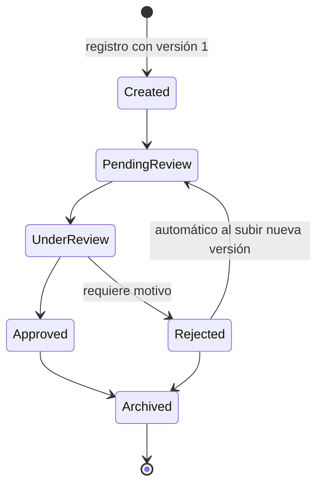

# ecert — Document Review API

API REST en **.NET 10** para gestionar documentos PDF a través de un flujo de revisión y aprobación: versiones, estados, observaciones y trazabilidad completa, con persistencia en **PostgreSQL** (EF Core) y análisis del PDF integrado vía **PdfPig**.

## Ejecución (Docker)

Único requisito: Docker con Docker Compose.

```bash
docker compose up --build -d
```

Eso levanta PostgreSQL y la API; al arrancar, la API **aplica las migraciones y siembra datos de ejemplo automáticamente**.

| Recurso | URL |
|---|---|
| API | `http://localhost:8080` |
| Documentación interactiva (Scalar) | <http://localhost:8080/scalar> |
| Especificación OpenAPI | <http://localhost:8080/openapi/v1.json> |
| Health check | <http://localhost:8080/health> |

## Tour guiado

Tres formas de recorrer la solución, según el tiempo disponible:

### Opción A — `./demo.sh` (cero esfuerzo, ~30 segundos)

```bash
./demo.sh
```

Un script narrado que ejecuta contra la API en vivo el ciclo de vida completo de un documento: muestra los datos sembrados y su trazabilidad, registra un contrato nuevo (con conteo de páginas vía PdfPig), lo envía a revisión, registra una observación, lo rechaza con motivo, sube la versión corregida, la aprueba, demuestra que la máquina de estados bloquea transiciones inválidas (409) y termina mostrando la auditoría completa. Requiere `curl` y `jq` o `python3`.

### Opción B — paso a paso con `curl`

Cada paso indica el requisito que demuestra.

**1. Registro del documento con su primera versión** *(registro + integración externa: la respuesta incluye `pageCount` calculado con PdfPig)*

```bash
curl -X POST http://localhost:8080/api/documents \
  -F "Title=Contrato Demo" \
  -F "Type=Contract" \
  -F "UploadedBy=juan.author" \
  -F "File=@samples/contrato-v1.pdf;type=application/pdf"
```

Guarde el `id` de la respuesta:

```bash
ID=<id de la respuesta>
```

**2. Enviar a revisión** *(cambio de estado: `Created → PendingReview`)*

```bash
curl -X POST http://localhost:8080/api/documents/$ID/status \
  -H "Content-Type: application/json" \
  -d '{"targetStatus":"PendingReview","performedBy":"juan.author"}'
```

**3. Tomar la revisión** *(`PendingReview → UnderReview`)*

```bash
curl -X POST http://localhost:8080/api/documents/$ID/status \
  -H "Content-Type: application/json" \
  -d '{"targetStatus":"UnderReview","performedBy":"maria.reviewer"}'
```

**4. Registrar una observación** *(revisiones y observaciones)*

```bash
curl -X POST http://localhost:8080/api/documents/$ID/observations \
  -H "Content-Type: application/json" \
  -d '{"type":"CorrectionRequest","content":"El plazo de la cláusula 2 no coincide con lo cotizado.","createdBy":"maria.reviewer"}'
```

**5. Rechazar con motivo obligatorio** *(el motivo queda registrado como observación `RejectionReason`; rechazar sin `reason` devuelve 400)*

```bash
curl -X POST http://localhost:8080/api/documents/$ID/status \
  -H "Content-Type: application/json" \
  -d '{"targetStatus":"Rejected","performedBy":"maria.reviewer","reason":"Corregir plazo y precio antes de reenviar."}'
```

**6. Subir la versión corregida** *(gestión de versiones: el documento rechazado vuelve automáticamente a `PendingReview`; subir un archivo idéntico devuelve 400)*

```bash
curl -X POST http://localhost:8080/api/documents/$ID/versions \
  -F "UploadedBy=juan.author" \
  -F "File=@samples/contrato-v2.pdf;type=application/pdf"
```

**7. Revisar y aprobar la versión 2**

```bash
curl -X POST http://localhost:8080/api/documents/$ID/status \
  -H "Content-Type: application/json" \
  -d '{"targetStatus":"UnderReview","performedBy":"maria.reviewer"}'

curl -X POST http://localhost:8080/api/documents/$ID/status \
  -H "Content-Type: application/json" \
  -d '{"targetStatus":"Approved","performedBy":"maria.reviewer"}'
```

**8. Verificar la coherencia del ciclo de vida** *(manejo de errores: transición inválida → 409 con ProblemDetails)*

```bash
curl -X POST http://localhost:8080/api/documents/$ID/status \
  -H "Content-Type: application/json" \
  -d '{"targetStatus":"Rejected","performedBy":"maria.reviewer","reason":"tarde"}'
```

**9. Trazabilidad completa** *(auditoría de todo lo ocurrido, y consulta de observaciones, versiones y archivos)*

```bash
curl http://localhost:8080/api/documents/$ID/history
curl http://localhost:8080/api/documents/$ID/observations
curl http://localhost:8080/api/documents/$ID                    # detalle + historial de versiones
curl -OJ http://localhost:8080/api/documents/$ID/file           # descarga el PDF vigente
curl -OJ http://localhost:8080/api/documents/$ID/versions/1/file # descarga la versión 1
```

### Opción C — interactiva

- **Scalar**: abrir <http://localhost:8080/scalar>; todos los endpoints con sus descripciones, probables desde el navegador.
- **Postman**: importar `Ecert.DocsReview.postman_collection.json`. Las carpetas están ordenadas como tour (registro → consulta → estados → observaciones → historial → versiones → validaciones) e incluyen casos de éxito y de error; para los requests con archivo, seleccionar los PDF de `samples/`.

## Ciclo de vida del documento



Reglas que evitan inconsistencias entre versiones y estados (implementadas en `DocumentStateMachine`, una clase de dominio pura y testeada de forma aislada):

- Solo se aceptan **nuevas versiones** en `Created`, `PendingReview` o `Rejected`; en un documento rechazado, la subida lo reencola automáticamente a `PendingReview`.
- Las **observaciones** solo se registran dentro del bucle de revisión (`PendingReview`, `UnderReview`, `Rejected`).
- **Rechazar exige un motivo**, que se persiste como observación `RejectionReason` sobre la versión rechazada.
- Se rechazan archivos que no son PDF, vacíos, demasiado grandes o **idénticos a la versión vigente** (comparación por SHA-256).

## Datos sembrados

El seeder deja tres documentos que cubren distintas etapas del ciclo de vida (útiles para consultar historial y observaciones sin crear nada):

| Documento | Tipo | Estado | Demuestra |
|---|---|---|---|
| Service Contract 2026 | Contract | PendingReview | Documento recién enviado, en cola de revisión |
| Quarterly Report Q1 | Report | Rejected | Dos versiones y dos rondas de rechazo con motivos; historial extenso |
| Pricing Quotation - Cert Renewal | Quotation | Approved | Flujo feliz completo con un comentario de revisión |

## Decisiones técnicas

- **Integración externa — PdfPig** (biblioteca local, requisito 5): al subir cada versión se valida que el archivo sea un PDF real y se obtiene el **conteo de páginas**, que se persiste y expone en las respuestas. Se eligió una biblioteca local en lugar de una API paga porque no requiere credenciales ni red (el proyecto corre completo con `docker compose up`), y la integración queda claramente separada del dominio detrás de la interfaz `IPdfAnalyzer` (`Infrastructure/Pdf/`): sustituirla por un servicio externo (OCR, clasificación, etc.) es implementar esa interfaz.
- **Máquina de estados como dominio puro** (`Domain/DocumentStateMachine.cs`): sin dependencias de EF ni HTTP, cada regla es testeable en aislamiento.
- **Trazabilidad por eventos**: cada acción (creación, subida de versión, cambio de estado, observación) genera un `DocumentEvent` inmutable; `GET /history` es la auditoría completa.
- **Archivos en disco, metadatos en PostgreSQL**: los PDF se guardan vía `IFileStorage` (volumen Docker) y la base guarda metadatos + SHA-256; separa el binario del modelo relacional y facilita migrar a un blob storage.
- **Errores como ProblemDetails (RFC 7807)**: 400 de validación, 404 inexistente, 409 conflicto de estado, con detalle legible.
- **Migraciones + seeder al arrancar**: `docker compose up` deja la base lista sin pasos manuales.
- **Tests**: 87 pruebas (unitarias de dominio e integración del pipeline HTTP real con `WebApplicationFactory` sobre SQLite en memoria). La documentación (OpenAPI/Scalar) también tiene smoke tests.

## Estructura del proyecto

```
src/Ecert.DocsReview.Api/
  Domain/           # Entidades, enums y máquina de estados (sin dependencias)
  Application/      # DocumentService: casos de uso y orquestación
  Contracts/        # DTOs de request/response
  Controllers/      # DocumentsController (REST)
  Infrastructure/   # EF Core (AppDbContext, migraciones, seeder), storage, PdfPig
tests/Ecert.DocsReview.Tests/
samples/            # PDFs de ejemplo para el tour (contrato-v1.pdf, contrato-v2.pdf)
demo.sh             # Tour guiado ejecutable
```

## Ejecutar los tests

Requiere el SDK de .NET 10 (no necesita base de datos: los tests de integración usan SQLite en memoria).

```bash
dotnet test
```

## Ejecución local sin Docker (opcional)

```bash
docker compose up db -d   # solo PostgreSQL
dotnet run --project src/Ecert.DocsReview.Api
# API en http://localhost:5206 (misma URL base para el tour: BASE_URL=http://localhost:5206 ./demo.sh)
```
